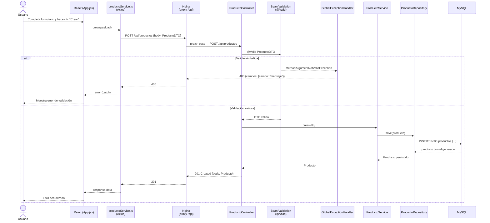
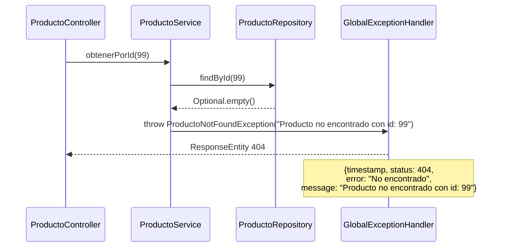
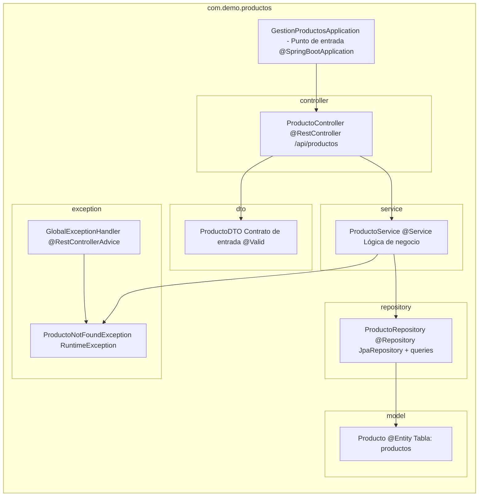

# Arquitectura — Gestión de Productos

Este documento describe el diseño interno del proyecto: flujo de una request HTTP, relaciones entre clases y decisiones de diseño encontradas en el código.

---

## Flujo completo de una request HTTP

El siguiente diagrama muestra el ciclo de vida de una petición desde el navegador hasta la base de datos y de vuelta, tomando como ejemplo `POST /api/productos`.

---

## Flujo de excepción — Producto no encontrado

---

## Relaciones entre clases

---

## Estructura de paquetes y responsabilidades

---

## Decisiones de diseño

### 1. Separación DTO / Entidad
El controlador nunca expone la entidad `Producto` directamente en los cuerpos de entrada. En cambio, recibe un `ProductoDTO` validado con `@Valid`. La entidad sí se devuelve como respuesta (sin un DTO de salida separado), lo que simplifica el código pero mezcla levemente las capas de persistencia y transporte.

**Implicación**: un cambio en el modelo (agregar un campo interno) podría filtrar datos hacia el cliente si no se agrega un DTO de respuesta.

---

### 2. Manejo de errores centralizado
`GlobalExceptionHandler` con `@RestControllerAdvice` centraliza toda la lógica de formateo de errores. Todos los errores devuelven un objeto JSON consistente con `timestamp`, `status`, `error` y `message`/`campos`, lo que facilita el consumo desde el frontend.

---

### 3. Perfil de tests con H2
`application-test.properties` configura H2 en memoria para los tests, sin necesidad de MySQL. El esquema se crea y destruye automáticamente (`ddl-auto=create-drop`), garantizando aislamiento entre suites.

---

### 4. CORS explícito en el controlador
`@CrossOrigin(origins = "http://localhost:3000")` está definido directamente en `ProductoController`. En un proyecto real con múltiples controladores, esta configuración debería centralizarse en una clase `WebMvcConfigurer`.

---

### 5. Multi-stage Docker builds
Tanto el backend como el frontend usan multi-stage builds para minimizar el tamaño de las imágenes finales. El backend compila con Maven y copia solo el JAR a una imagen JRE Alpine. El frontend compila con Node y sirve los estáticos desde Nginx Alpine.

---

### 6. Proxy Nginx como punto de entrada único
En producción Docker, Nginx actúa como reverse proxy: sirve el frontend en `/` y redirige `/api` al backend. El frontend usa rutas relativas (`/api/productos`) por lo que funciona tanto en desarrollo (proxy de `react-scripts`) como en producción (proxy de Nginx) sin cambiar código.

---

### 7. Bugs intencionales como ejercicio pedagógico
El servicio y el frontend contienen 14 bugs documentados (`// BUG #N`) que cubren anti-patrones reales:

| Categoría | Bugs |
|-----------|------|
| Inyección de dependencias | #1 — field injection en lugar de constructor |
| Validación de parámetros | #2, #5, #7, #8 |
| Lógica de negocio | #3, #4, #6 |
| HTTP incorrecto en frontend | #9 |
| UX / manejo de errores | #10, #11, #12, #13, #14 |

Los `.cursorrules` del proyecto definen las convenciones correctas para contrastar contra los bugs.

---

### 8. Convención de nombres en español
Todos los métodos de negocio, variables y entidades usan nombres en español (`obtenerTodos`, `buscarPorCategoria`, `fechaCreacion`). Los nombres de anotaciones, interfaces de Spring y métodos de test siguen el inglés técnico estándar de Java.
