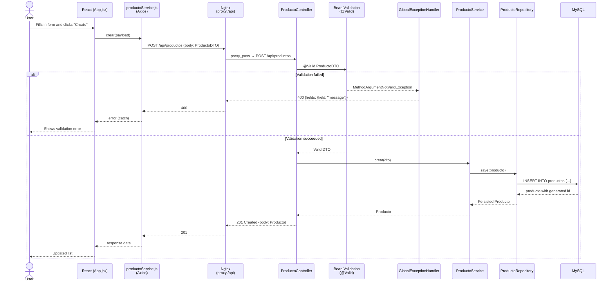
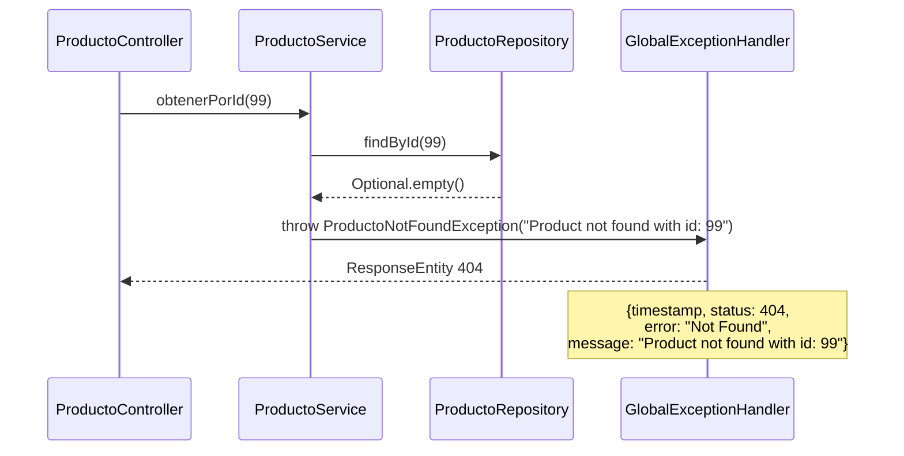
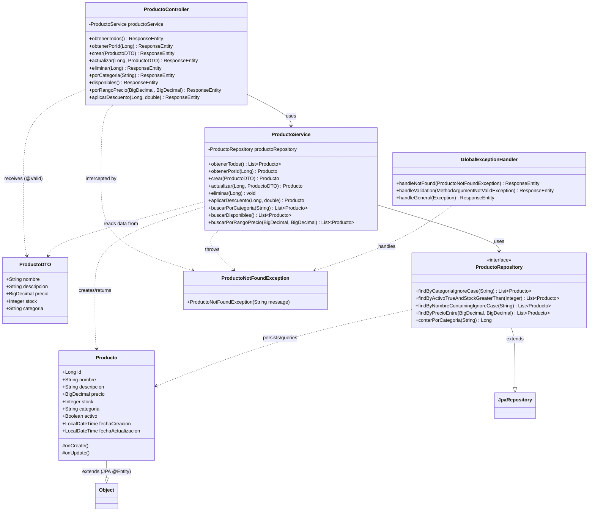
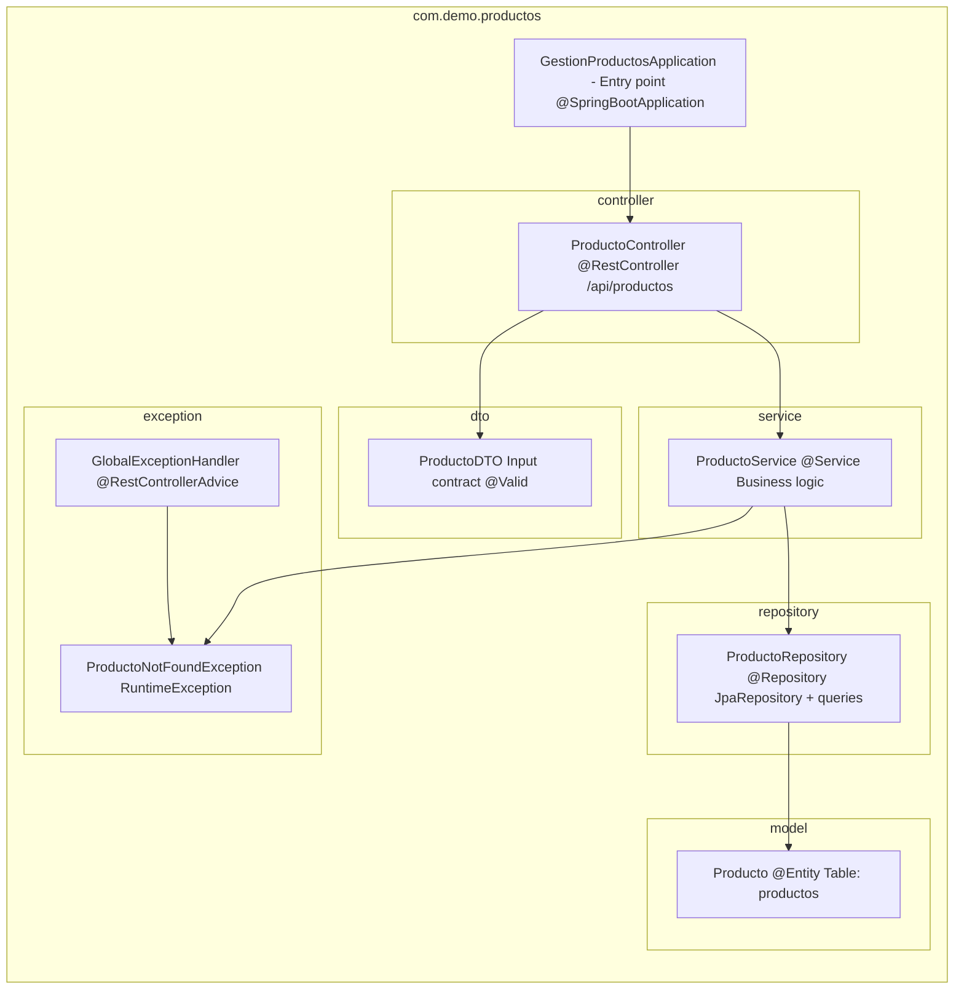

# Architecture — Product Management

This document describes the internal design of the project: HTTP request flow, class relationships, and design decisions found in the code.

---

## Full HTTP request flow

The following diagram shows the lifecycle of a request from the browser to the database and back, using `POST /api/productos` as an example.

---

## Exception flow — Product not found

---

## Class relationships

---

## Package structure and responsibilities

---

## Design decisions

### 1. DTO / Entity separation
The controller never exposes the `Producto` entity directly in request bodies. Instead, it receives a `ProductoDTO` validated with `@Valid`. The entity is returned as the response (without a separate output DTO), which simplifies the code but slightly blurs the persistence and transport layers.

**Implication**: a model change (adding an internal field) could leak data to the client if a response DTO is not added.

---

### 2. Centralized error handling
`GlobalExceptionHandler` with `@RestControllerAdvice` centralizes all error formatting logic. All errors return a consistent JSON object with `timestamp`, `status`, `error` and `message`/`fields`, making frontend consumption straightforward.

---

### 3. H2 test profile
`application-test.properties` configures an in-memory H2 database for tests, with no MySQL dependency. The schema is created and destroyed automatically (`ddl-auto=create-drop`), guaranteeing isolation between test suites.

---

### 4. Explicit CORS on the controller
`@CrossOrigin(origins = "http://localhost:3000")` is defined directly on `ProductoController`. In a real project with multiple controllers, this configuration should be centralized in a `WebMvcConfigurer` class.

---

### 5. Multi-stage Docker builds
Both the backend and frontend use multi-stage builds to minimize final image sizes. The backend compiles with Maven and copies only the JAR to a JRE Alpine image. The frontend compiles with Node and serves static files from Nginx Alpine.

---

### 6. Nginx proxy as single entry point
In the Docker production setup, Nginx acts as a reverse proxy: it serves the frontend at `/` and forwards `/api` to the backend. The frontend uses relative paths (`/api/productos`) so it works in both development (proxy via `react-scripts`) and production (proxy via Nginx) without any code changes.

---

### 7. Intentional bugs as a teaching exercise
The service and frontend contain 14 documented bugs (`// BUG #N`) covering real anti-patterns:

| Category | Bugs |
|----------|------|
| Dependency injection | #1 — field injection instead of constructor |
| Parameter validation | #2, #5, #7, #8 |
| Business logic | #3, #4, #6 |
| Incorrect HTTP in frontend | #9 |
| UX / error handling | #10, #11, #12, #13, #14 |

The project's `.cursorrules` define the correct conventions to contrast against the bugs.

---

### 8. Spanish naming convention
All business methods, variables, and entities use Spanish names (`obtenerTodos`, `buscarPorCategoria`, `fechaCreacion`). Annotation names, Spring interfaces, and test methods follow standard Java technical English.
